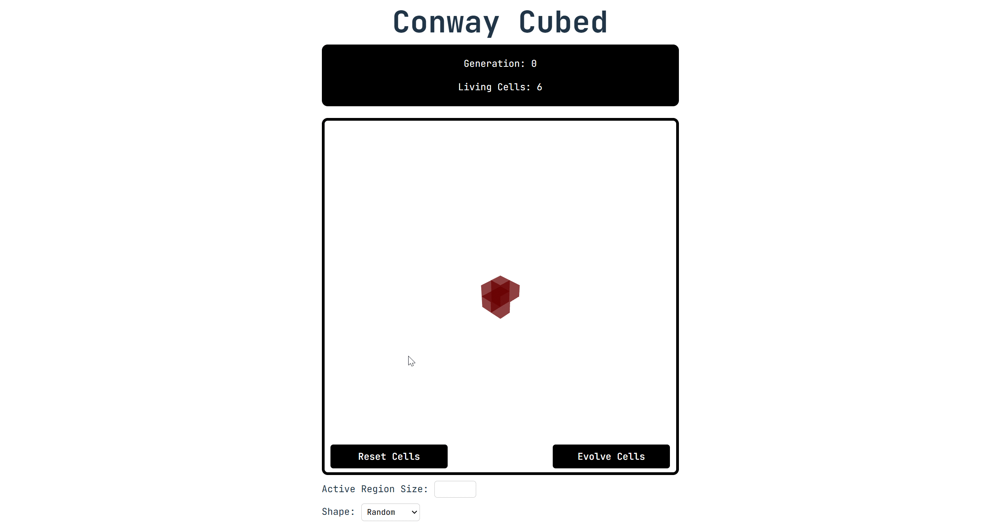

# Conway Cubed

Conway Cubed is a 3D implementation of Conway's Game of Life. Built with **React** and **Three.js**,
this project brings the classic cellular automaton into an interactive, three-dimensional space. Check it out here:
[Explore Conway Cubed](https://conwaycubed.netlify.app/)

## Features

- **Interactive 3D Grid**: Visualize and manipulate cells in a 3D environment
- **Customizable States**: Explore different shapes and active starting regions
- **Generational Tracking**: Watch the number of cells grow or diminish as generations evolve over time

## Game of Life Rules in 3D

- Each cell has up to 26 neighbors
- Any live cell with less than 5 live neighbors dies, as if by underpopulation
- Any live cell with more than 6 live neighbors dies, as if by overpopulation
- Any dead cell with exactly 4 live neighbors becomes a live cell, as if by reproduction
